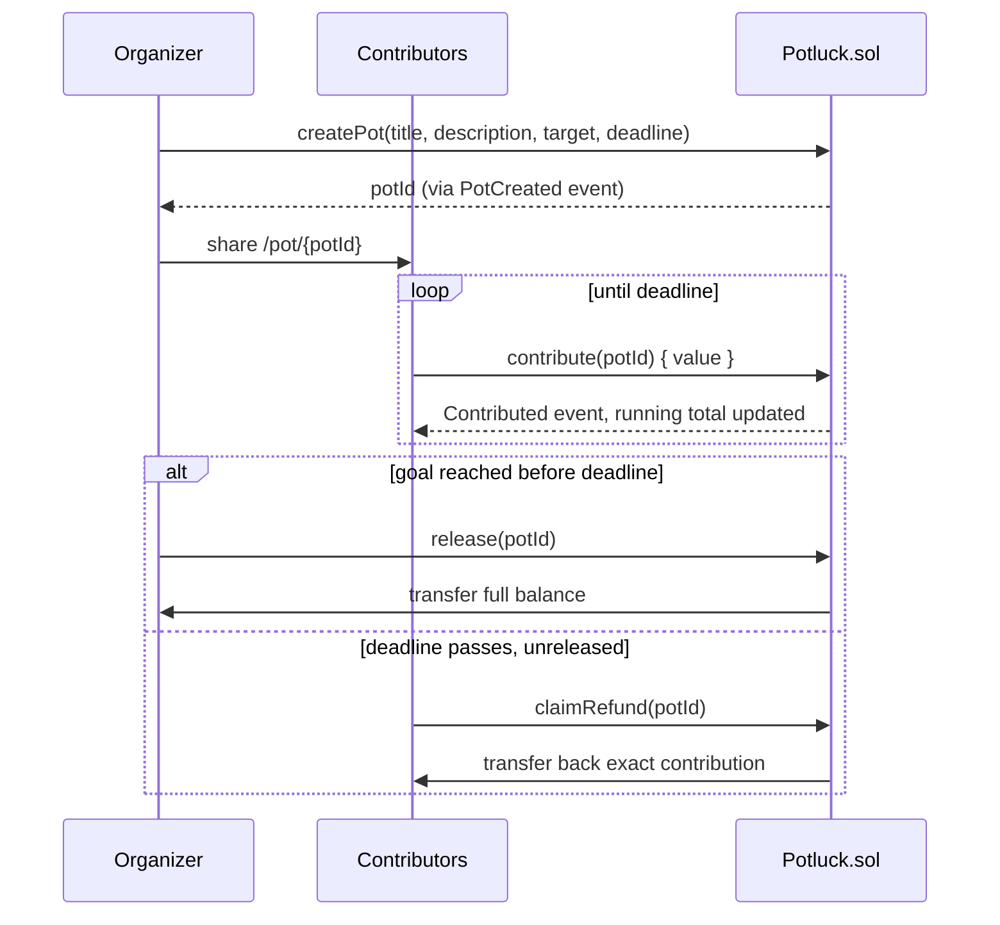
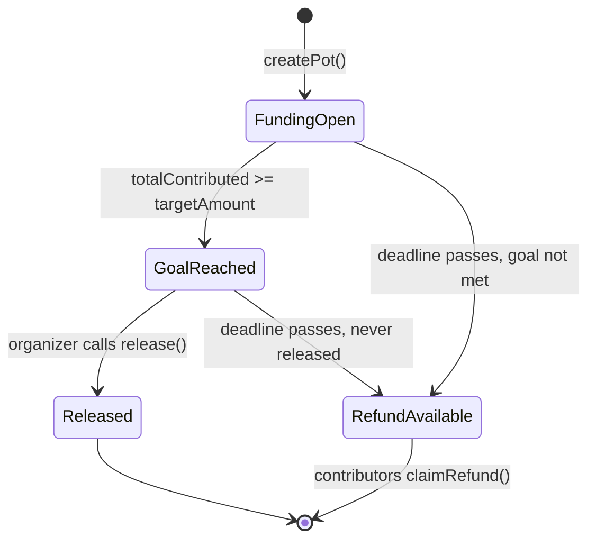
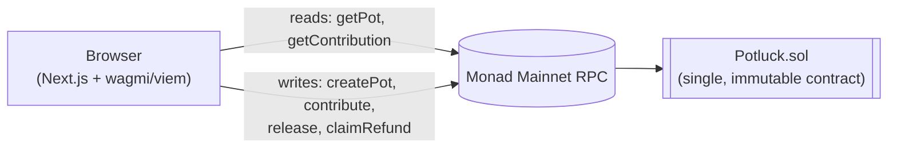

<div align="center">

# Potluck

### Stop being the friend group's bank.

Potluck is a shared pot for group money — trip deposits, gifts, bulk orders, whatever needs
everyone to chip in. Contributors send MON toward a goal and a deadline. Hit the goal in time and
the organizer gets paid out. Miss it, and every contributor gets their money back automatically —
no one has to ask, and no one has to hold the money in between.

<!-- Hero Screenshot -->

[](#testing)
[](https://monadscan.com/address/0x38777e7308398B4D91E1359fF2ac08148AE9A6b0)
[](https://monadscan.com/address/0x38777e7308398B4D91E1359fF2ac08148AE9A6b0)
[](./src/Potluck.sol)
[](./frontend)
[](./LICENSE)

**[Contract on Monadscan](https://monadscan.com/address/0x38777e7308398B4D91E1359fF2ac08148AE9A6b0)** · **[Report an Issue](https://github.com/Guna-Asher/Potluck/issues)**

</div>

<br>

<details>
<summary><strong>Contents</strong></summary>

- [The Problem](#the-problem)
- [Why a Smart Contract](#why-a-smart-contract)
- [How It Works](#how-it-works)
- [Live Demo](#live-demo)
- [Screenshots](#screenshots)
- [Architecture](#architecture)
- [Features](#features)
- [Smart Contract](#smart-contract)
- [Tech Stack](#tech-stack)
- [Local Development](#local-development)
- [Testing](#testing)
- [Deployment](#deployment)
- [Project Structure](#project-structure)
- [FAQ](#faq)
- [Known Limitations & What's Next](#known-limitations--whats-next)
- [License](#license)

</details>

## The Problem

Group money is always the same story: a trip house, concert tickets, a shared gift, a bulk order.
One person fronts the full cost, then spends the next two weeks chasing everyone else for their
share.

Splitwise tracks *who owes what*, but it doesn't move money and can't enforce anything. Venmo
moves money, but once it's sent, it's gone — there's no "collect from everyone by Friday, or give
it all back." The organizer is always the one holding the risk: if the plan falls through after
they've already paid a non-refundable deposit, they eat the loss alone.

Potluck replaces that honor system with a smart contract:

1. **Create a pot** — name it, set a funding goal in MON, pick a deadline.
2. **Share the link** — one URL, no app download, no account.
3. **Friends contribute** — anyone with a wallet chips in any amount toward the goal.
4. **One of two outcomes, enforced by code** — goal met in time, the organizer releases the pot.
   Goal missed, every contributor claims back exactly what they put in.

## Why a Smart Contract

Neither Venmo nor Splitwise can actually hold money and wait. Splitwise only tracks the math.
Venmo only moves money on the spot, one send at a time — someone still has to collect it, hold it,
and be trusted to hand it back if the plan falls apart.

With Potluck, the money itself sits in the contract, not in a person's account, until the goal is
hit or the deadline passes. The rules for releasing or refunding it can't be bent — not by the
organizer, not by whoever built this.

> [!NOTE]
> Monad is what makes this practical for a $10 group chip-in instead of just large transactions.
> Sub-second finality and low fees mean a group of eight people each sending a small amount is
> fast and cheap enough to actually feel like Venmo — see [Testing](#testing) and
> [Smart Contract](#smart-contract) for how that guarantee is actually enforced on-chain.

## How It Works



Every pot is in exactly one of four states at any moment — computed identically on-chain and in
the UI, so the badge you see and the button you can click never disagree:



## Live Demo

<!-- Live app link -->
<!-- Demo GIF -->
<!-- Video Walkthrough -->

The contract itself is already live — see [Contract on Monadscan](https://monadscan.com/address/0x38777e7308398B4D91E1359fF2ac08148AE9A6b0)
or run the frontend locally against it in under a minute: [Local Development](#local-development).

## Screenshots

<!-- Hero Screenshot -->
<!-- Mobile Screenshot -->

## Architecture



- **No backend, no indexer, no database.** Every read hits the contract directly through wagmi's
  `useReadContract`, polled every 4 seconds while a pot page is open.
- **No custom API routes.** The frontend is a Next.js App Router app that talks to the chain
  client-side.
- **Pot history is local-only.** `/pots` reads from `localStorage`, not an indexer — it reflects
  what *this browser* has visited, not a full on-chain record of every pot tied to a wallet (see
  [Known Limitations](#known-limitations--whats-next)).

## Features

**Core mechanics**

- Create a pot — title, description, MON goal, deadline — in one transaction
- Contribute any amount, any number of times, from any wallet
- Organizer-gated release, only once the goal is met and only before the deadline
- Self-serve refunds for every contributor if the pot expires unreleased, including if the
  organizer never shows up — and they never expire: a contribution stays claimable for as long
  as the contract exists
- Live per-pot progress: amount raised, percent funded, contributor count, countdown to deadline

**Frontend**

- One-URL sharing — anyone can open a pot and see live progress, no account needed
- Local "My Pots" dashboard (`/pots`) tracking every pot this browser has created or opened
- Plain-language error messages mapped from every contract revert reason
- Network guard that detects the wrong chain and offers a one-click switch
- Toast notifications and progress-bar animation for every transaction state
- Copy-to-clipboard pot links with a fallback for restrictive browser contexts

## Smart Contract

[`src/Potluck.sol`](./src/Potluck.sol) — one self-contained escrow contract, under 200 lines, zero
external imports. No proxies, no admin keys, no upgrade path.

| Function | Access | Description |
|---|---|---|
| `createPot(title, description, targetAmount, deadline)` | anyone | Registers a new pot; caller becomes the organizer |
| `contribute(potId)` *(payable)* | anyone | Adds `msg.value` to the pot, before the deadline |
| `release(potId)` | organizer only | Pays the full balance to the organizer once the goal is met, before the deadline |
| `claimRefund(potId)` | any contributor | Returns the caller's own contribution once the pot has expired unreleased |
| `getPot(potId)` | view | Full pot state for the frontend tracker |
| `getContribution(potId, address)` | view | One address's contribution to a pot |

**Events:** `PotCreated`, `Contributed`, `Released`, `Refunded` — the frontend decodes `PotCreated`
from the transaction receipt to recover the new `potId`, since a sent transaction has no direct
return value.

<details>
<summary><strong>Custom errors</strong> (gas-efficient, mapped 1:1 to plain-language copy in <code>lib/format.ts</code>)</summary>

<br>

`InvalidPotId` · `DeadlineInPast` · `ZeroTarget` · `AlreadyReleased` · `DeadlinePassed` ·
`DeadlineNotReached` · `ZeroValue` · `NotOrganizer` · `TargetNotMet` · `NoContribution` ·
`TransferFailed`

</details>

> [!IMPORTANT]
> **Security decisions, not afterthoughts:**
> - **Checks-effects-interactions.** `release()` and `claimRefund()` update state (`released =
>   true`, zeroing the contributor's balance) *before* the external `.call{value: amount}("")`,
>   closing the standard reentrancy vector — verified by a dedicated attacker-contract suite
>   (`PotluckReentrancy.t.sol`).
> - **No admin key, no upgrade path, no pausability.** Once deployed, the contract's behavior
>   cannot change — by anyone, including whoever wrote it.
> - **Abandoned-organizer fallback.** `claimRefund` works for every contributor after the deadline
>   regardless of whether the goal was met, so an organizer who never calls `release()` can't
>   strand anyone's funds.
> - **Refunds have no expiry.** `claimRefund` checks only that the deadline has passed and the
>   pot was never released — there is no claim window, no admin sweep, and no forfeiture path
>   anywhere in the contract. An unclaimed contribution can't be reclaimed by the organizer, the
>   deployer, or anyone else; it stays in escrow, claimable only by its contributor, indefinitely.
>   That's the user-protection floor this whole design rests on: the worst case for a contributor
>   is always "get exactly your money back, whenever you get around to it."

## Tech Stack

| Layer | Choice |
|---|---|
| Smart contract | Solidity `^0.8.24`, [Foundry](https://getfoundry.sh/) (build, test, deploy, verify) |
| Chain | Monad Mainnet (chain ID `143`) |
| Frontend framework | Next.js 15 (App Router, Turbopack) |
| UI | React 19, Tailwind CSS 4 |
| Wallet / chain interaction | wagmi 3, viem 2 (MetaMask connector) |
| Data fetching / caching | TanStack React Query |
| Animation | Framer Motion |
| Language | TypeScript, strict mode |

## Local Development

**Prerequisites:** Node.js `^18.18.0 || ^19.8.0 || >= 20.0.0`, and [Foundry](https://getfoundry.sh/)
if you want to build or test the contract.

```bash
git clone --recurse-submodules https://github.com/Guna-Asher/Potluck.git
cd Potluck/frontend
cp .env.local.example .env.local
npm install
npm run dev
```

The app runs against the already-deployed, verified contract on Monad Mainnet — you don't need to
deploy anything to run the frontend locally. You'll need MetaMask connected to Monad Mainnet with
some MON to contribute or create pots. **This is real money on mainnet** — small amounts are
plenty for trying it out.

<details>
<summary><strong>Environment variables</strong></summary>

<br>

**Frontend** (`frontend/.env.local`, see `frontend/.env.local.example`)

| Variable | Description |
|---|---|
| `NEXT_PUBLIC_MONAD_RPC_URL` | RPC endpoint the frontend reads/writes through (default: `https://rpc.monad.xyz` — the public endpoint is rate-limited, so production should use a dedicated provider URL) |

**Contract deployment** (`.env` at the project root, see `.env.example` — only needed to deploy your own instance)

| Variable | Description |
|---|---|
| `MONAD_MAINNET_RPC_URL` | RPC endpoint used for mainnet deployment (`monad_mainnet` alias in `foundry.toml`) |
| `MONAD_TESTNET_RPC_URL` | RPC endpoint for testnet deployments (`monad_testnet` alias) |
| `MONADSCAN_API_KEY` | API key for contract verification on Monadscan (both networks) |

The deployer key is **not** an environment variable: pass it on the forge CLI via an encrypted
keystore (`cast wallet import` + `--account`). Never put a mainnet private key in a `.env` file.

The contract address and ABI are not environment variables — they're committed constants in
[`frontend/lib/contract.ts`](./frontend/lib/contract.ts), since this build targets one specific,
already-deployed, immutable contract.

</details>

## Testing

52 passing tests across four Foundry suites, including fuzz tests run 1,000 times each per
`foundry.toml`:

| Suite | Focus | Tests |
|---|---|---|
| `Potluck.t.sol` | Unit tests and happy paths for every function, plus 2 fuzz tests | 35 |
| `PotluckEdgeCases.t.sol` | Boundary conditions — exact-deadline timing, overfunding, repeat contributors | 6 |
| `PotluckSecurity.t.sol` | Access control, griefing vectors, invariants | 8 |
| `PotluckReentrancy.t.sol` | Active reentrancy attempts via attacker contracts (`test/utils/Attackers.sol`) | 3 |

```bash
forge test              # run everything
forge test --summary    # per-suite breakdown
forge coverage           # coverage report
```

> [!TIP]
> The frontend currently relies on TypeScript's strict mode and ESLint (`npm run lint`) rather
> than a dedicated test suite — see [Known Limitations](#known-limitations--whats-next).

## Deployment

**Smart contract** — deployed and verified on Monad Mainnet at the address above.

```bash
source .env
forge script script/Deploy.s.sol:Deploy --rpc-url monad_mainnet \
  --account potluck-deployer --sender <deployer-address> --broadcast --verify -vvvv
```

If you deploy your own instance, update `POTLUCK_ADDRESS` in `frontend/lib/contract.ts`.

**Frontend** — a standard Next.js App Router app, ready for Vercel (`frontend/vercel.json`). This
repo is a monorepo (Foundry at the root, Next.js in `frontend/`), so when connecting a host:

| Setting | Value |
|---|---|
| Root / Base Directory | `frontend` |
| Build command | `npm run build` |
| Output directory | `.next` (default — no static export) |
| Environment variables | `NEXT_PUBLIC_MONAD_RPC_URL` |

## Project Structure

<details>
<summary><strong>Expand full tree</strong></summary>

```
potluck/
├── src/Potluck.sol                  # The escrow contract
├── script/Deploy.s.sol              # Foundry deployment script
├── test/
│   ├── Potluck.t.sol                # Unit + happy-path tests, incl. fuzz
│   ├── PotluckEdgeCases.t.sol       # Boundary conditions
│   ├── PotluckSecurity.t.sol        # Access control, griefing, invariants
│   ├── PotluckReentrancy.t.sol      # Active reentrancy attempts
│   └── utils/Attackers.sol          # Test-double attacker contracts
├── foundry.toml
└── frontend/
    ├── app/
    │   ├── page.tsx                 # Landing page
    │   ├── create/page.tsx          # Create-pot flow
    │   ├── pot/[potId]/page.tsx     # Pot detail / tracker
    │   ├── pots/page.tsx            # Local pot-history dashboard
    │   ├── layout.tsx               # Root layout (nav, network guard, metadata)
    │   ├── providers.tsx            # wagmi + react-query + toast providers
    │   ├── error.tsx                # Global error boundary
    │   ├── icon.tsx                 # Generated favicon
    │   └── opengraph-image.tsx      # Generated social card
    ├── components/
    │   ├── ui/                      # Card, PageHeader — shared shells
    │   ├── landing/                 # Reveal, CountUpNumber, HeroPotPreview
    │   ├── CreatePotForm.tsx / ContributeForm.tsx
    │   ├── ReleaseButton.tsx / ClaimRefundButton.tsx
    │   ├── PotHeader.tsx / PotProgress.tsx / PotStatusBadge.tsx / PotCard.tsx
    │   ├── TransactionStatus.tsx / Toast.tsx
    │   ├── NavBar.tsx / NetworkGuard.tsx / WalletConnectButton.tsx
    │   └── CopyLinkButton.tsx / ExplorerLink.tsx / PageTransition.tsx
    ├── hooks/
    │   ├── usePot.ts                # Single source of truth for a pot's live state
    │   ├── useContribution.ts / usePotHistory.ts
    │   └── useCreatePot.ts / useContribute.ts / useRelease.ts / useClaimRefund.ts / useTransactionToast.ts
    └── lib/
        ├── chain.ts / contract.ts / wagmiConfig.ts
        ├── format.ts                # MON formatting, countdowns, friendly errors
        ├── potStatus.ts             # Single source of truth for pot lifecycle state
        └── potHistory.ts            # localStorage-backed pot history
```

</details>

## FAQ

**Do refunds expire?**
No. Once a pot's deadline passes without `release()` being called, `claimRefund()` has no time
limit — the contract checks *that* the deadline has passed, never how long ago. There is no
refund window, no admin sweep, and no forfeiture mechanism; nobody else can ever take an
unclaimed contribution.

**What if the organizer disappears?**
Nothing is lost. Refunds don't involve the organizer at all — after the deadline, `claimRefund`
pays each contributor their own recorded amount, whether or not the goal was met and whether or
not the organizer is ever heard from again.

**What if I forget to claim my refund for months or years?**
It waits. Your contribution is recorded in contract storage that only you can zero out, by
claiming it. A claim made a year later pays exactly what you put in — the only cost of waiting
is the gas on the eventual claim transaction.

## Known Limitations & What's Next

| Today | Because | Natural next step |
|---|---|---|
| MetaMask-only wallet support | Single injected connector, built for the demo | WalletConnect / Coinbase Wallet as additional connectors |
| `/pots` is local, per-browser history | No indexer — `localStorage` only, resets if you clear browser data | An indexer or subgraph for a full, cross-device, per-wallet pot history |
| No frontend automated test suite | Contract logic is heavily tested; UI is verified manually plus TypeScript/ESLint | Component and integration tests for the write flows |
| The pot-wide status badge still reads "Refund Available" even once every contributor has claimed — each wallet does see its own accurate "Refund available" vs. "Refund claimed" locally | The contract tracks no aggregate refund counter, and deriving one client-side would mean scanning full event history — the default RPC caps `eth_getLogs` at a 100-block range, so that isn't a single-call operation | Either a small contract addition (a `totalRefunded` counter, read in O(1)) or indexed event infrastructure. Both are deferred intentionally, to avoid redeploying the current verified contract or compromising the fully on-chain, no-backend architecture for one badge label |

None of this affects the contract's core guarantee — the escrow logic itself is fully tested and
immutable regardless of what the frontend does or doesn't have yet.

## License

[MIT](./LICENSE)
