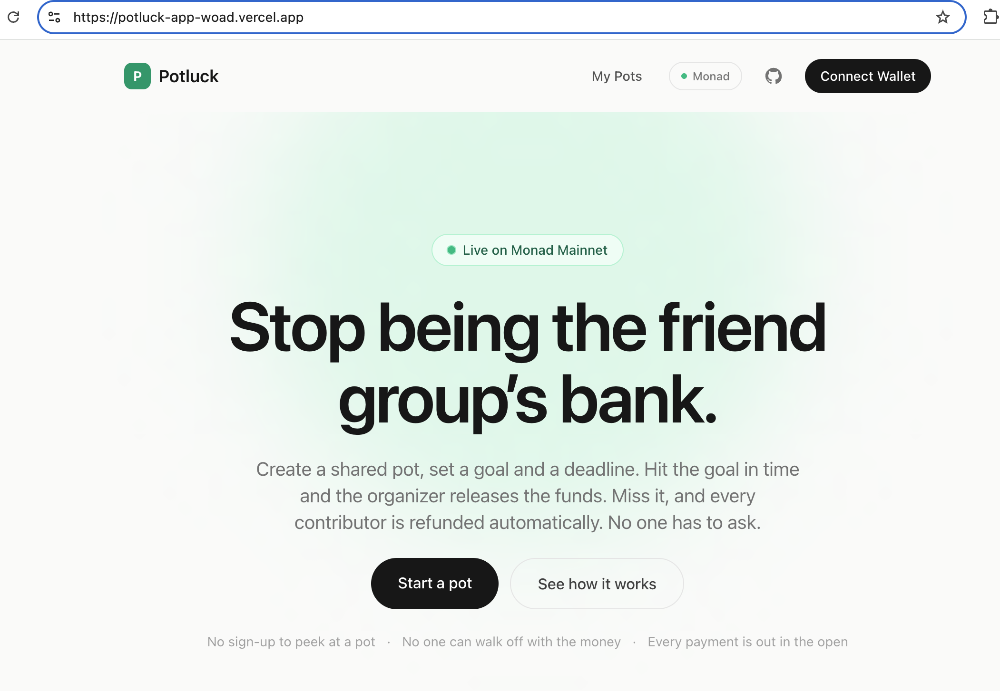
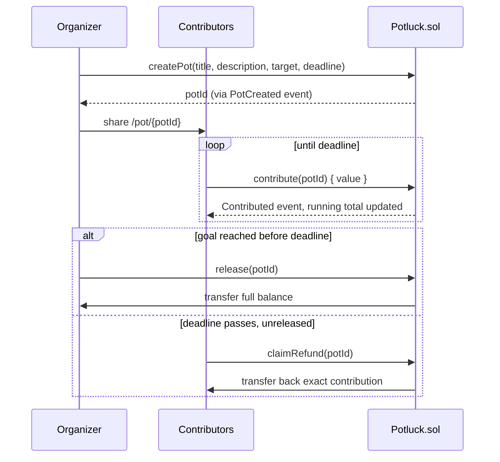
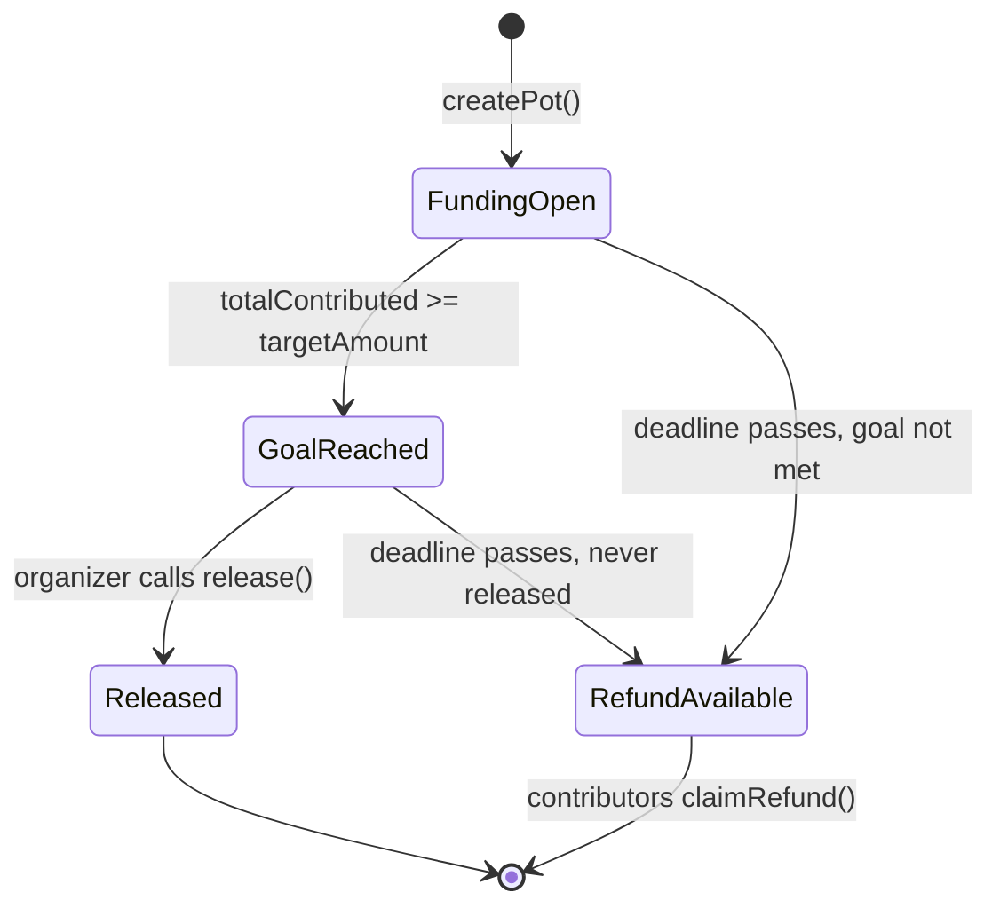
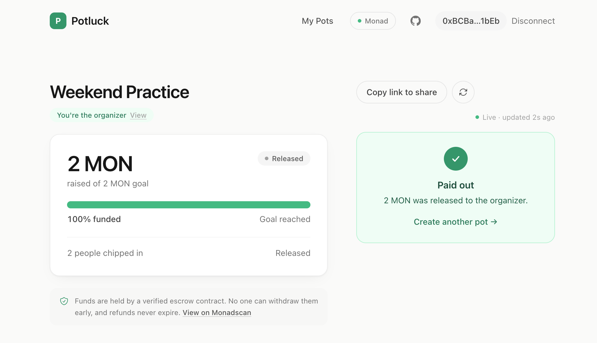
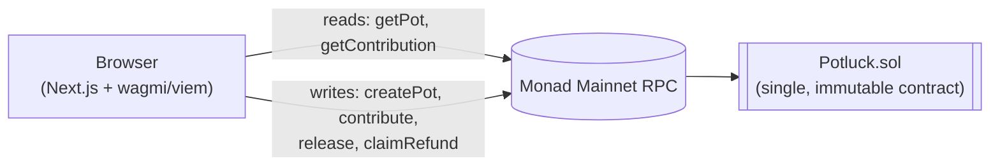
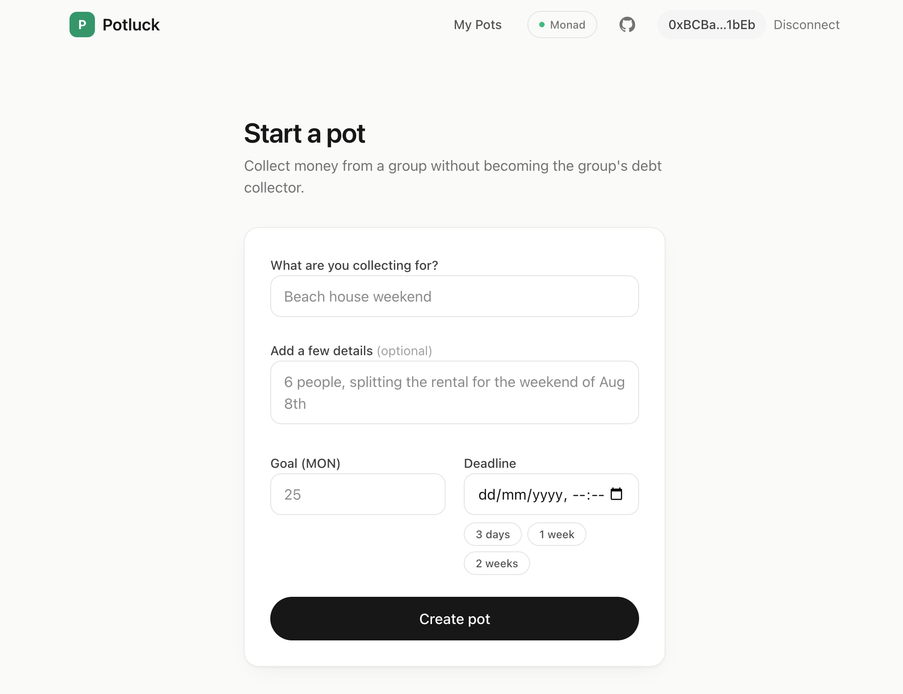

<div align="center">

# Potluck

### Stop being the friend group's bank.

Potluck is a shared pot for group money: trip deposits, gifts, bulk orders, anything that needs
everyone to chip in. Contributors send MON toward a goal and a deadline. Hit the goal in time and
the organizer gets paid out. Miss it, and every contributor gets their money back. Nobody has to
collect the money or hold it in between.

[](https://potluck-app-woad.vercel.app/)
[](#testing)
[](https://monadscan.com/address/0x38777e7308398B4D91E1359fF2ac08148AE9A6b0)
[](https://monadscan.com/address/0x38777e7308398B4D91E1359fF2ac08148AE9A6b0)
[](./src/Potluck.sol)
[](./LICENSE)

**[Open the app](https://potluck-app-woad.vercel.app/)** · **[Watch the demo](https://x.com/Guna_Asher/status/2078404340583485701?s=20)** · **[Contract on Monadscan](https://monadscan.com/address/0x38777e7308398B4D91E1359fF2ac08148AE9A6b0)** · **[Report an issue](https://github.com/Guna-Asher/Potluck/issues)**



</div>

<br>

<details>
<summary><strong>Contents</strong></summary>

- [Demo Video](#demo-video)
- [Try It in 60 Seconds](#try-it-in-60-seconds)
- [Why This Matters](#why-this-matters)
- [How It Works](#how-it-works)
- [Real Mainnet Example](#real-mainnet-example)
- [Architecture](#architecture)
- [Features](#features)
- [Smart Contract](#smart-contract)
- [Security](#security)
- [Design System](#design-system)
- [Tech Stack](#tech-stack)
- [Local Development](#local-development)
- [Testing](#testing)
- [Deployment](#deployment)
- [Project Structure](#project-structure)
- [FAQ](#faq)
- [Known Limitations & What's Next](#known-limitations--whats-next)
- [License](#license)

</details>

## Demo Video


https://github.com/user-attachments/assets/95443abb-01fb-44e8-bfd6-2a41d07ec203


Watch a short walkthrough of Potluck on Monad Mainnet.

In under 3 minutes you'll see:

- Creating a pot
- Sharing the link
- Contributing from another wallet
- Reaching the goal
- Releasing funds
- The refund flow

## Try It in 60 Seconds

You can open the app immediately, no clone or setup required. It runs on Monad Mainnet, so use
small amounts when trying it.

1. **Open the app:** [potluck-app-woad.vercel.app](https://potluck-app-woad.vercel.app/)
2. **See a finished pot:** [pot #4, "Weekend Practice"](https://potluck-app-woad.vercel.app/pot/4) was
   funded by two contributors and released to its organizer, all on mainnet.
3. **Create your own pot:** set a title, a MON goal, and a deadline (quick-picks: 3 days, 1 week,
   2 weeks).
4. **Share the link.** Anyone can open it and watch live progress without an account.
5. **Contribute from another wallet** and watch the pot update in a few seconds.
6. **Release or refund.** If the goal is met in time, the organizer releases the funds. If not,
   every contributor claims back exactly what they put in.

You'll need MetaMask. The app prompts the network switch to Monad Mainnet automatically.

## Why This Matters

Group money is always the same story: one person fronts the full cost, then spends two weeks
chasing everyone else for their share.

- **Splitwise tracks who owes what**, but it moves no money and enforces nothing.
- **Venmo moves money**, but only on the spot, one send at a time. Someone still has to collect
  it, hold it, and be trusted to hand it back if the plan falls apart.
- **The organizer carries all the risk.** If the plan dies after a non-refundable deposit,
  they eat the loss alone.

Potluck replaces that honor system with escrow. Until the goal is hit or the deadline passes,
the money sits in a contract instead of someone's personal account. Nobody fronts the cost or
chases payments, and if the plan falls through, everyone gets their exact contribution back.
The rules can't be bent by the organizer, or by whoever built this.

> [!NOTE]
> Monad is what makes this practical for a $10 chip-in instead of just large transactions.
> Sub-second finality and low fees mean eight people each sending a small amount feels like
> Venmo, with the guarantees enforced on-chain.

## How It Works



Every pot is in exactly one of four states at any moment, computed identically on-chain and in
the UI, so the badge you see and the button you can click never disagree:



## Real Mainnet Example

The success path has already run end-to-end with real money:

| | |
|---|---|
| Pot | [#4 "Weekend Practice"](https://potluck-app-woad.vercel.app/pot/4) |
| Goal | 2 MON, fully funded |
| Contributors | 2 |
| Outcome | Released to the organizer before the deadline |
| Verify it yourself | [Contract on Monadscan](https://monadscan.com/address/0x38777e7308398B4D91E1359fF2ac08148AE9A6b0) (events: `PotCreated`, `Contributed`, `Released`) |

This is the same pot the landing page links to. Its data is immutable on-chain history, so the
link never goes stale.



## Architecture



- **There is no backend, indexer, or database.** Every read hits the contract directly through wagmi's
  `useReadContract`, polled every 4 seconds while a pot page is open.
- **No custom API routes.** The frontend is a Next.js App Router app that talks to the chain
  client-side.
- **Pot history is local-only.** `/pots` reads from `localStorage`, scoped to chain 143. It
  reflects what *this browser* has visited, not a full on-chain record (see
  [Known Limitations](#known-limitations--whats-next)).

## Features

**Core mechanics**

- Create a pot (title, description, MON goal, deadline) in one transaction
- Contribute any amount, any number of times, from any wallet
- Organizer-gated release, only once the goal is met and only before the deadline
- Self-serve refunds for every contributor if the pot expires unreleased, including if the
  organizer never shows up. Refunds never expire.
- Live per-pot progress: amount raised, percent funded, contributor count, countdown

**Product**

- One-URL sharing: anyone can open a pot and see live progress, no account needed
- Live data indicator ("updated Ns ago") plus a manual refresh control on every pot page
- Escrow trust row on the money page, linking to the verified contract
- Deadline quick-picks (3 days / 1 week / 2 weeks) alongside a full date-time picker
- Organizer recognition: the pot header knows when *you* are the organizer
- Local "My Pots" dashboard (`/pots`), chain-scoped so testnet history can't leak in
- Loading skeletons shaped like the actual page layout

**Polish**

- Plain-language error messages mapped from every contract revert reason
- Cancelling a transaction in your wallet shows a neutral toast rather than a red error
- Network guard that detects the wrong chain and offers a one-click switch
- Keyboard-accessible: visible focus states on every button and link
- Responsive from phone to desktop, including a two-column pot page with a sticky action rail
- Copy-to-clipboard pot links with a fallback for restrictive browser contexts



## Smart Contract

[`src/Potluck.sol`](./src/Potluck.sol) is a single self-contained escrow contract, under 200
lines, with zero external imports. There are no proxies, admin keys, or upgrade paths.

| Function | Access | Description |
|---|---|---|
| `createPot(title, description, targetAmount, deadline)` | anyone | Registers a new pot and makes the caller its organizer |
| `contribute(potId)` *(payable)* | anyone | Adds `msg.value` to the pot, before the deadline |
| `release(potId)` | organizer only | Pays the full balance to the organizer once the goal is met, before the deadline |
| `claimRefund(potId)` | any contributor | Returns the caller's own contribution once the pot has expired unreleased |
| `getPot(potId)` | view | Full pot state for the frontend tracker |
| `getContribution(potId, address)` | view | One address's contribution to a pot |

**Events:** `PotCreated`, `Contributed`, `Released`, `Refunded`. The frontend decodes `PotCreated`
from the transaction receipt to recover the new `potId`, since a sent transaction has no direct
return value.

<details>
<summary><strong>Custom errors</strong> (gas-efficient, mapped 1:1 to plain-language copy in <code>lib/format.ts</code>)</summary>

<br>

`InvalidPotId` · `DeadlineInPast` · `ZeroTarget` · `AlreadyReleased` · `DeadlinePassed` ·
`DeadlineNotReached` · `ZeroValue` · `NotOrganizer` · `TargetNotMet` · `NoContribution` ·
`TransferFailed`

</details>

## Security

**Audit status:** not externally audited. The contract is deliberately small and dependency-free
so it can be reviewed in one sitting.

| Property | How it's enforced |
|---|---|
| No reentrancy | Checks-effects-interactions: `release()` and `claimRefund()` update state before the external call. Verified by an attacker-contract suite (`PotluckReentrancy.t.sol`). |
| No rug pull | There is no admin key, upgrade path, or pausability. Once deployed, behavior cannot change, even for whoever wrote it. |
| No stranded funds | `claimRefund` works for every contributor after the deadline whether or not the goal was met, so an absent organizer can't lock anyone's money. |
| No refund expiry | There is no claim window, admin sweep, or forfeiture path. An unclaimed contribution stays in escrow indefinitely, claimable only by its contributor. |
| Pull over push | Refunds are claimed per-contributor, so one reverting recipient can't block anyone else. |

The worst case for a contributor is always the same: you get exactly your money back, whenever
you get around to claiming it. See the [FAQ](#faq) for the refund guarantees in plain language.

## Design System

The frontend follows a small written design system: [`frontend/DESIGN.md`](./frontend/DESIGN.md).
The short version:

- **Color carries meaning.** Four hue families total. Emerald means "money moving the right
  way" and is never decorative. Neutral ink does everything else.
- **Shape grammar.** Pills are interactive, rounded rectangles are containers. Two radii, two
  elevation levels, all tokenized.
- **Still by default.** Money UI shouldn't shimmer while someone decides whether to send.
  Motion is limited to a few key moments and respects `prefers-reduced-motion`.
- **Accessibility.** Global keyboard focus treatment, `aria` on status surfaces, and icons that
  never carry meaning without adjacent text.

## Tech Stack

| Layer | Choice |
|---|---|
| Smart contract | Solidity `^0.8.24`, [Foundry](https://getfoundry.sh/) (build, test, deploy, verify) |
| Chain | Monad Mainnet (chain ID `143`) |
| Frontend framework | Next.js 15 (App Router, Turbopack) |
| UI | React 19, Tailwind CSS 4 |
| Wallet / chain interaction | wagmi 3, viem 2 (MetaMask connector) |
| Data fetching / caching | TanStack React Query |
| Animation | Framer Motion |
| Language | TypeScript, strict mode |

## Local Development

**Prerequisites:** Node.js `^18.18.0 || ^19.8.0 || >= 20.0.0`, and [Foundry](https://getfoundry.sh/)
if you want to build or test the contract.

```bash
git clone --recurse-submodules https://github.com/Guna-Asher/Potluck.git
cd Potluck/frontend
cp .env.local.example .env.local
npm install
npm run dev
```

The app runs against the already-deployed, verified contract on Monad Mainnet. You don't need to
deploy anything to run the frontend locally. You'll need MetaMask connected to Monad Mainnet with
some MON to contribute or create pots. **This is real money**, so keep amounts small.

<details>
<summary><strong>Environment variables</strong></summary>

<br>

**Frontend** (`frontend/.env.local`, see `frontend/.env.local.example`)

| Variable | Description |
|---|---|
| `NEXT_PUBLIC_MONAD_RPC_URL` | RPC endpoint the frontend reads/writes through. Defaults to `https://rpc.monad.xyz`, which is rate-limited, so production should use a dedicated provider URL |

**Contract deployment** (`.env` at the project root, see `.env.example`). You only need these to deploy your own instance.

| Variable | Description |
|---|---|
| `MONAD_MAINNET_RPC_URL` | RPC endpoint used for mainnet deployment (`monad_mainnet` alias in `foundry.toml`) |
| `MONAD_TESTNET_RPC_URL` | RPC endpoint for testnet deployments (`monad_testnet` alias) |
| `MONADSCAN_API_KEY` | API key for contract verification on Monadscan (both networks) |

The deployer key is **not** an environment variable: pass it on the forge CLI via an encrypted
keystore (`cast wallet import` + `--account`). Never put a mainnet private key in a `.env` file.

The contract address and ABI are not environment variables either. They're committed constants in
[`frontend/lib/contract.ts`](./frontend/lib/contract.ts), since this build targets one specific,
already-deployed, immutable contract.

</details>

## Testing

52 passing tests across four Foundry suites, including fuzz tests run 1,000 times each per
`foundry.toml`:

| Suite | Focus | Tests |
|---|---|---|
| `Potluck.t.sol` | Unit tests and happy paths for every function, plus 2 fuzz tests | 35 |
| `PotluckEdgeCases.t.sol` | Boundary conditions: exact-deadline timing, overfunding, repeat contributors | 6 |
| `PotluckSecurity.t.sol` | Access control, griefing vectors, invariants | 8 |
| `PotluckReentrancy.t.sol` | Active reentrancy attempts via attacker contracts (`test/utils/Attackers.sol`) | 3 |

```bash
forge test              # run everything
forge test --summary    # per-suite breakdown
forge coverage          # coverage report
```

> [!TIP]
> The frontend currently relies on TypeScript's strict mode and ESLint (`npm run lint`) rather
> than a dedicated test suite. See [Known Limitations](#known-limitations--whats-next).

## Deployment

| | |
|---|---|
| Live app | [potluck-app-woad.vercel.app](https://potluck-app-woad.vercel.app/) |
| Network | Monad Mainnet (chain ID `143`) |
| Contract | [`0x38777e7308398B4D91E1359fF2ac08148AE9A6b0`](https://monadscan.com/address/0x38777e7308398B4D91E1359fF2ac08148AE9A6b0) |
| Verification | Source verified on Monadscan (exact match) |

**Deploying your own instance:**

```bash
source .env
forge script script/Deploy.s.sol:Deploy --rpc-url monad_mainnet \
  --account potluck-deployer --sender <deployer-address> --broadcast --verify -vvvv
```

Then update `POTLUCK_ADDRESS` in `frontend/lib/contract.ts`.

**Frontend hosting:** a standard Next.js App Router app, ready for Vercel
(`frontend/vercel.json`). This repo is a monorepo (Foundry at the root, Next.js in `frontend/`),
so when connecting a host:

| Setting | Value |
|---|---|
| Root / Base Directory | `frontend` |
| Build command | `npm run build` |
| Output directory | `.next` (default, no static export) |
| Environment variables | `NEXT_PUBLIC_MONAD_RPC_URL` |

## Project Structure

<details>
<summary><strong>Expand full tree</strong></summary>

```
potluck/
├── src/Potluck.sol                  # The escrow contract
├── script/Deploy.s.sol              # Foundry deployment script (keystore-based)
├── test/
│   ├── Potluck.t.sol                # Unit + happy-path tests, incl. fuzz
│   ├── PotluckEdgeCases.t.sol       # Boundary conditions
│   ├── PotluckSecurity.t.sol        # Access control, griefing, invariants
│   ├── PotluckReentrancy.t.sol      # Active reentrancy attempts
│   └── utils/Attackers.sol          # Test-double attacker contracts
├── foundry.toml
└── frontend/
    ├── DESIGN.md                    # Written design system (tokens, rules, motion)
    ├── app/
    │   ├── page.tsx                 # Landing page
    │   ├── create/page.tsx          # Create-pot flow
    │   ├── pot/[potId]/page.tsx     # Pot detail / tracker
    │   ├── pots/page.tsx            # Local pot-history dashboard
    │   ├── layout.tsx               # Root layout (nav, network guard, metadata)
    │   ├── providers.tsx            # wagmi + react-query + toast providers
    │   ├── globals.css              # Design tokens (@theme) + global focus styles
    │   ├── error.tsx                # Global error boundary
    │   ├── icon.tsx                 # Generated favicon
    │   └── opengraph-image.tsx      # Generated social card
    ├── components/
    │   ├── ui/                      # Card, PageHeader, icons — shared primitives
    │   ├── landing/                 # Reveal, CountUpNumber, HeroPotPreview
    │   ├── CreatePotForm.tsx / ContributeForm.tsx
    │   ├── ReleaseButton.tsx / ClaimRefundButton.tsx
    │   ├── PotHeader.tsx / PotProgress.tsx / PotStatusBadge.tsx / PotCard.tsx
    │   ├── PotSkeleton.tsx          # Layout-shaped loading state
    │   ├── EscrowTrustRow.tsx       # Custody note + verified-contract link
    │   ├── LiveIndicator.tsx        # "Live · updated Ns ago"
    │   ├── RefreshButton.tsx        # Manual refetch of all contract reads
    │   ├── TransactionStatus.tsx / Toast.tsx
    │   ├── NavBar.tsx / NetworkGuard.tsx / WalletConnectButton.tsx
    │   └── CopyLinkButton.tsx / ExplorerLink.tsx / PageTransition.tsx
    ├── hooks/
    │   ├── usePot.ts                # Single source of truth for a pot's live state
    │   ├── useContribution.ts / usePotHistory.ts / useClaimedRefund.ts
    │   └── useCreatePot.ts / useContribute.ts / useRelease.ts / useClaimRefund.ts / useTransactionToast.ts
    └── lib/
        ├── chain.ts / contract.ts / wagmiConfig.ts
        ├── format.ts                # MON formatting, countdowns, friendly errors
        ├── potStatus.ts             # Single source of truth for pot lifecycle state
        ├── potHistory.ts            # localStorage-backed pot history (chain-scoped)
        └── claimedRefunds.ts        # Local record of refunds this browser claimed
```

</details>

## FAQ

**Do refunds expire?**
No. Once a pot's deadline passes without `release()` being called, `claimRefund()` has no time
limit. The contract checks *that* the deadline has passed, never how long ago. There is no
refund window, admin sweep, or forfeiture mechanism, and nobody else can ever take an unclaimed
contribution.

**What if the organizer disappears?**
Nothing is lost. Refunds don't involve the organizer at all. After the deadline, `claimRefund`
pays each contributor their own recorded amount, whether or not the goal was met and whether or
not the organizer is ever heard from again.

**What if I forget to claim my refund for months or years?**
It waits. Your contribution is recorded in contract storage that only you can zero out, by
claiming it. A claim made a year later pays exactly what you put in. The only cost of waiting
is the gas on the eventual claim transaction.

## Known Limitations & What's Next

| Today | Because | Natural next step |
|---|---|---|
| MetaMask-only wallet support | A single injected connector kept the first release small | WalletConnect / Coinbase Wallet as additional connectors |
| `/pots` is local, per-browser history | There is no indexer, so history lives in `localStorage` and resets with browser data | An indexer or subgraph for a full, cross-device, per-wallet pot history |
| No frontend automated test suite | Contract logic is heavily tested, while the UI relies on manual checks, TypeScript, and ESLint | Component and integration tests for the write flows |
| The pot-wide badge reads "Refund Available" even after every contributor has claimed (each wallet does see its own accurate claim state) | The contract has no aggregate refund counter, and public RPCs limit `eth_getLogs` ranges, so deriving one client-side isn't a single call | A `totalRefunded` counter in a future contract version, or indexed events. Deferred deliberately: not worth redeploying a verified contract or adding a backend for one badge label |

None of this affects the contract's core guarantee. The escrow logic is fully tested and
immutable regardless of what the frontend does or doesn't have yet.

## License

[MIT](./LICENSE)
