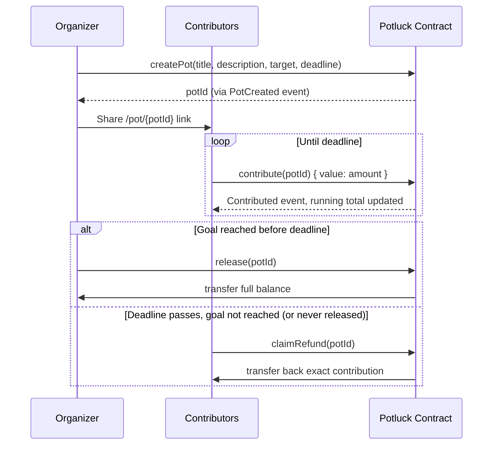

# Potluck

**Stop being the friend group's bank.**

Potluck is a trustless, onchain escrow for group money pools. Create a pot, share a link, and let a smart contract — not a person — decide whether the money gets released or refunded.

[](https://testnet.monadscan.com/address/0xA4C72147682a2E56A5e4344befcB5eddec2fa3a1)
[](https://testnet.monadscan.com/address/0xA4C72147682a2E56A5e4344befcB5eddec2fa3a1)
[](./src/Potluck.sol)
[](./frontend)
[](./test)
[](./LICENSE)

[Contract on Monadscan](https://testnet.monadscan.com/address/0xA4C72147682a2E56A5e4344befcB5eddec2fa3a1)

> 🎥 **Demo video:** _link to be added_
> 🔗 **Live app:** _link to be added_

---

## Table of Contents

- [The Problem](#the-problem)
- [The Solution](#the-solution)
- [Why Blockchain Is Actually Needed](#why-blockchain-is-actually-needed)
- [How It Works](#how-it-works)
- [Features](#features)
- [Architecture](#architecture)
- [Smart Contract](#smart-contract)
- [Tech Stack](#tech-stack)
- [Project Structure](#project-structure)
- [Local Development](#local-development)
- [Environment Variables](#environment-variables)
- [Testing](#testing)
- [Deployment](#deployment)
- [Security Notes](#security-notes)
- [Known Limitations](#known-limitations)
- [License](#license)

---

## The Problem

Group money is always the same story: a trip house, concert tickets, an Airbnb, a shared gift, a bulk order. One person fronts the full cost, then spends the next two weeks chasing everyone else for their share.

Tools like Splitwise help you track *who owes what* — but they don't move money, and they can't enforce anything. Payment apps like Venmo move money, but once you send it, it's gone. There's no concept of "collect from everyone by Friday, or give it all back."

The organizer is always the one holding the risk: if the plan falls through after they've already paid a non-refundable deposit, they eat the loss alone.

## The Solution

Potluck replaces the honor system with a smart contract.

1. **Create a pot** — name it, set a funding goal in MON, and pick a deadline.
2. **Share the link** — one URL, no app download, no account creation.
3. **Friends contribute** — anyone with a wallet can chip in any amount toward the goal.
4. **One of two outcomes, enforced by code:**
   - **Goal met before the deadline** → the organizer releases the full pot to themselves.
   - **Goal missed** → every contributor claims back exactly what they put in — no request, no approval, no organizer involved.

Nobody — not the organizer, not Potluck — ever has custody of the money in between. The contract does.

## Why Blockchain Is Actually Needed

This isn't blockchain for its own sake. The core guarantee — *"the money either goes to the organizer under the agreed conditions, or comes back to me, and neither of us can change that"* — is exactly the kind of neutral, tamper-proof custody a smart contract is for.

| Without a blockchain | With Potluck |
|---|---|
| The organizer holds the money — contributors must trust them not to spend it or disappear | The contract holds the money — no individual ever has custody |
| A payment company could hold funds, but takes a cut and sets its own refund policy | Refund logic is public, immutable code — not a company's discretion |
| "I'll pay you back if it doesn't work out" is a promise | Refund eligibility is a `require`/custom-error check, not a promise |
| Trust has to be established in every new group, every time | Trust is in the contract, verifiable by anyone, every time |

Monad specifically makes this practical for casual group use: sub-second finality and low fees mean a $10 contribution doesn't feel like a chore, and a group of 8 people each sending a small transaction is fast and cheap enough to actually feel like Venmo.

## How It Works



Every pot has exactly one of four states at any moment, computed identically on-chain and in the UI:

| Status | Condition |
|---|---|
| **Funding Open** | Before the deadline, goal not yet reached |
| **Goal Reached** | Before the deadline, `totalContributed >= targetAmount` |
| **Released** | Organizer has called `release()` |
| **Refund Available** | Deadline has passed and the pot was never released — regardless of whether the goal was met |

## Features

**Core mechanics**
- Create funding pots — title, description, MON goal, and deadline, deployed onchain in one transaction
- Contribute any amount, any number of times, from any wallet
- Organizer-gated release, only once the goal is met and only before the deadline
- Self-serve refunds for every contributor if the pot expires unreleased — including if the organizer simply never shows up
- Live per-pot progress: amount raised, percentage funded, contributor count, countdown to deadline

**Frontend**
- One-URL sharing — anyone can open a pot and see live progress with no account
- Local "My Pots" dashboard (`/pots`) tracking every pot this browser has created or opened
- Friendly, plain-language error messages mapped from every contract revert reason
- Network guard that detects the wrong chain and offers a one-click switch
- Toast notifications and subtle page/progress-bar animations for every transaction state
- Copy-to-clipboard pot links with a graceful fallback for restrictive browser contexts

## Architecture

```
┌─────────────────────┐        JSON-RPC        ┌───────────────────────┐
│   Next.js Frontend   │◄──────────────────────►│   Monad Testnet Node  │
│  (wagmi + viem +     │                        │                       │
│   React Query)       │                        └───────────┬───────────┘
└─────────────────────┘                                      │
                                                    calls / reads
                                                               │
                                                   ┌───────────▼───────────┐
                                                   │    Potluck.sol        │
                                                   │  (single, immutable,  │
                                                   │   verified contract)  │
                                                   └───────────────────────┘
```

- **No backend, no indexer, no database.** Every read (`getPot`, `getContribution`) hits the contract directly through `wagmi`'s `useReadContract`, polled every 4 seconds while a pot page is open.
- **No custom API routes.** The frontend is a static/SSR Next.js App Router app that talks to the chain client-side.
- **Pot history is local-only.** `/pots` reads from `localStorage`, not an indexer — it reflects what *this browser* has visited, not a full onchain record of every pot tied to a wallet.

## Smart Contract

[`src/Potluck.sol`](./src/Potluck.sol) — a single, self-contained escrow contract. No proxies, no admin keys, no upgrade path.

| Function | Access | Description |
|---|---|---|
| `createPot(title, description, targetAmount, deadline)` | anyone | Registers a new pot; caller becomes the organizer |
| `contribute(potId)` *(payable)* | anyone | Adds `msg.value` to the pot, before the deadline |
| `release(potId)` | organizer only | Pays the full balance to the organizer once the goal is met, before the deadline |
| `claimRefund(potId)` | any contributor | Returns the caller's own contribution once the pot has expired unreleased |
| `getPot(potId)` | view | Full pot state for the frontend tracker |
| `getContribution(potId, address)` | view | One address's contribution to a pot |

**Custom errors** (gas-efficient, and mapped 1:1 to plain-language copy in [`lib/format.ts`](./frontend/lib/format.ts)): `InvalidPotId`, `DeadlineInPast`, `ZeroTarget`, `AlreadyReleased`, `DeadlinePassed`, `DeadlineNotReached`, `ZeroValue`, `NotOrganizer`, `TargetNotMet`, `NoContribution`, `TransferFailed`.

**Events**: `PotCreated`, `Contributed`, `Released`, `Refunded` — the frontend decodes `PotCreated` from the transaction receipt to recover the new `potId` (a sent transaction has no direct return value; only a simulated call would).

## Tech Stack

| Layer | Choice |
|---|---|
| Smart contract | Solidity `^0.8.24`, [Foundry](https://getfoundry.sh/) (build, test, deploy, verify) |
| Chain | Monad Testnet (chain ID `10143`) |
| Frontend framework | Next.js 15 (App Router, Turbopack) |
| UI | React 19, Tailwind CSS 4 |
| Wallet / chain interaction | wagmi 3, viem 2 (MetaMask connector) |
| Data fetching / caching | TanStack React Query |
| Animation | Framer Motion |
| Language | TypeScript, strict mode |

## Project Structure

```
potluck/
├── src/
│   └── Potluck.sol                  # The escrow contract
├── script/
│   └── Deploy.s.sol                 # Foundry deployment script
├── test/
│   ├── Potluck.t.sol                 # Unit + happy-path tests
│   ├── PotluckEdgeCases.t.sol        # Boundary conditions
│   ├── PotluckSecurity.t.sol         # Access control, griefing, invariants
│   ├── PotluckReentrancy.t.sol       # Active reentrancy attempts
│   └── utils/
│       └── Attackers.sol             # Test-double attacker contracts
├── foundry.toml
└── frontend/
    ├── app/
    │   ├── page.tsx                  # Marketing landing page
    │   ├── create/page.tsx           # Create-pot flow
    │   ├── pot/[potId]/page.tsx      # Pot detail / tracker
    │   ├── pots/page.tsx             # Local pot-history dashboard
    │   ├── layout.tsx                # Root layout (nav, network guard, page transitions)
    │   ├── providers.tsx             # wagmi + react-query + toast providers
    │   ├── error.tsx                 # Global error boundary
    │   └── icon.tsx                  # Generated favicon
    ├── components/
    │   ├── ui/
    │   │   ├── Card.tsx              # Shared card shell (shadow/border/radius)
    │   │   └── PageHeader.tsx        # Shared page title/subtitle block
    │   ├── CreatePotForm.tsx
    │   ├── ContributeForm.tsx
    │   ├── ReleaseButton.tsx
    │   ├── ClaimRefundButton.tsx
    │   ├── PotHeader.tsx
    │   ├── PotProgress.tsx           # Progress bar, remaining amount, status badge
    │   ├── PotStatusBadge.tsx        # Funding Open / Goal Reached / Released / Refund Available
    │   ├── PotCard.tsx               # Dashboard tile for /pots
    │   ├── CopyLinkButton.tsx
    │   ├── TransactionStatus.tsx     # Pending/confirming/confirmed/error, animated
    │   ├── Toast.tsx                 # App-wide toast notifications
    │   ├── NavBar.tsx
    │   ├── NetworkGuard.tsx
    │   ├── PageTransition.tsx
    │   ├── WalletConnectButton.tsx
    │   └── ExplorerLink.tsx
    ├── hooks/
    │   ├── usePot.ts                 # Single source of truth for a pot's live state
    │   ├── useContribution.ts        # Connected wallet's own contribution
    │   ├── usePotHistory.ts          # Reads/writes local pot history
    │   ├── useCreatePot.ts
    │   ├── useContribute.ts
    │   ├── useRelease.ts
    │   ├── useClaimRefund.ts
    │   └── useTransactionToast.ts    # Shared success/error toast for every write flow
    └── lib/
        ├── chain.ts                  # Monad Testnet chain definition
        ├── contract.ts               # Deployed address + ABI
        ├── wagmiConfig.ts             # wagmi client config
        ├── format.ts                  # MON formatting, countdowns, friendly errors
        ├── potStatus.ts               # Single source of truth for pot lifecycle state
        └── potHistory.ts              # localStorage-backed pot history
```

## Local Development

**Prerequisites:** Node.js `^18.18.0 || ^19.8.0 || >= 20.0.0`, and [Foundry](https://getfoundry.sh/) if you want to build/test the contract.

```bash
# Clone with submodules (forge-std)
git clone --recurse-submodules https://github.com/Guna-Asher/Potluck.git
cd potluck

# --- Frontend ---
cd frontend
cp .env.local.example .env.local
npm install
npm run dev
```

The app runs against the already-deployed, verified contract on Monad Testnet — you don't need to deploy anything yourself to run the frontend locally. You'll need a MetaMask wallet connected to Monad Testnet with some testnet MON to contribute or create pots.

## Environment Variables

**Frontend** (`frontend/.env.local`, see `frontend/.env.local.example`):

| Variable | Description |
|---|---|
| `NEXT_PUBLIC_MONAD_RPC_URL` | RPC endpoint the frontend reads/writes through (default: `https://testnet-rpc.monad.xyz/`) |

**Contract deployment** (`.env` at the project root, see `.env.example` — only needed if you're deploying your own instance):

| Variable | Description |
|---|---|
| `PRIVATE_KEY` | Deployer wallet private key (testnet only — never commit this) |
| `MONAD_TESTNET_RPC_URL` | RPC endpoint used for deployment (default: `https://testnet-rpc.monad.xyz/`) |
| `MONADSCAN_API_KEY` | API key for contract verification on Monadscan |

The contract address and ABI are not environment variables — they're committed constants in [`frontend/lib/contract.ts`](./frontend/lib/contract.ts), since this build targets one specific, already-deployed, immutable contract.

## Testing

The contract has 52 passing tests across four suites, run with Foundry:

```bash
forge test           # run everything
forge test --summary # per-suite breakdown
forge coverage        # coverage report
```

| Suite | Focus | Tests |
|---|---|---|
| `Potluck.t.sol` | Unit tests and happy paths for every function | 35 |
| `PotluckEdgeCases.t.sol` | Boundary conditions (exact-deadline timing, overfunding, repeat contributors) | 6 |
| `PotluckSecurity.t.sol` | Access control, griefing vectors, invariants | 8 |
| `PotluckReentrancy.t.sol` | Active reentrancy attempts via attacker contracts (`test/utils/Attackers.sol`) | 3 |

The frontend currently relies on TypeScript's strict mode and ESLint (`npm run lint`) rather than a dedicated test suite.

## Deployment

**Smart contract** — already deployed and verified on Monad Testnet at the address above. To deploy your own instance:

```bash
source .env
forge script script/Deploy.s.sol:Deploy \
  --rpc-url monad_testnet \
  --broadcast \
  --verify \
  -vvvv
```

This deploys `Potluck.sol` and verifies it on Monadscan. If you deploy a new instance, update `POTLUCK_ADDRESS` in `frontend/lib/contract.ts` accordingly.

**Frontend** — a standard Next.js App Router app. This repository is a monorepo (Foundry project at the root, Next.js app in `frontend/`), so when connecting it to a host:

- **Root/Base Directory:** `frontend`
- **Build command:** `npm run build`
- **Output directory:** `.next` (default — do not configure a static export)
- **Environment variables:** set `NEXT_PUBLIC_MONAD_RPC_URL` in the host's dashboard

```bash
cd frontend
npm run build
npm run start
```

## Security Notes

- **Checks-effects-interactions.** Both `release()` and `claimRefund()` update contract state (`released = true`, zeroing the contributor's balance) *before* making the external `.call{value: amount}("")`, closing the standard reentrancy vector — verified by a dedicated attacker-contract test suite (`PotluckReentrancy.t.sol`).
- **No admin key, no upgrade path, no pausability.** Once deployed, the contract's behavior cannot change.
- **Abandoned-organizer fallback.** `claimRefund` is available to every contributor after the deadline regardless of whether the goal was met — an organizer who simply never calls `release()` cannot strand anyone's funds.
- **Custom errors over `require` strings** for clearer reverts and lower gas, each mapped to a specific plain-language message in the frontend rather than surfacing raw Solidity errors to users.

## Known Limitations

- **MetaMask-only wallet support.** The app currently connects through a single MetaMask connector; there is no WalletConnect, Coinbase Wallet, or other injected-wallet fallback yet.
- **No onchain indexer.** `/pots` is a local, per-browser history (via `localStorage`), not a full record of every pot a wallet has ever touched — clearing browser data resets it.
- **No frontend automated test suite.** Contract logic is heavily tested; UI behavior is currently verified manually plus TypeScript/ESLint.

## License

[MIT](./LICENSE)
