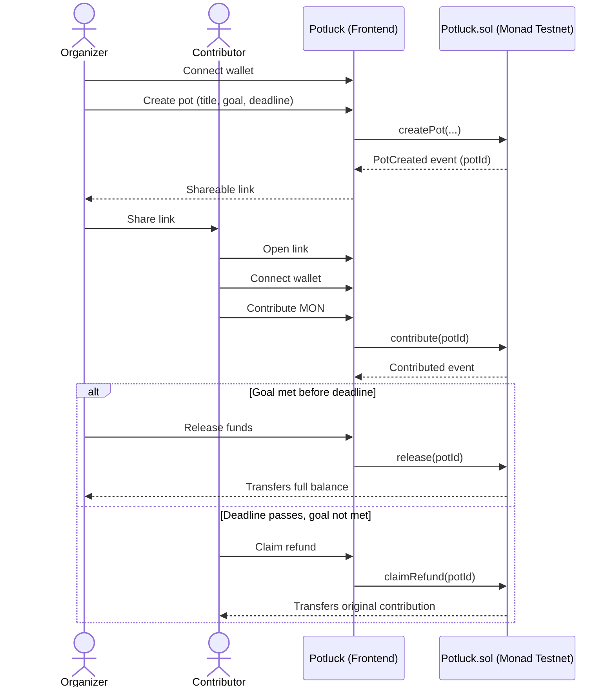
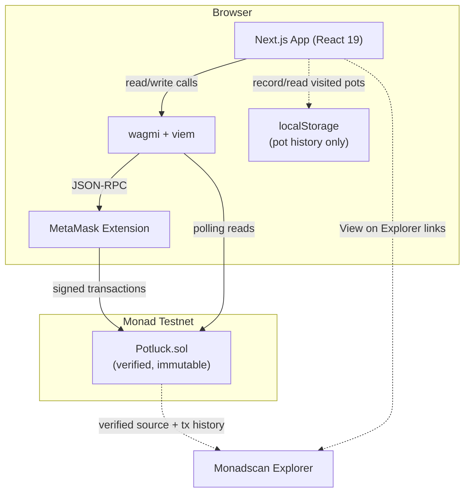

# Potluck

**Stop being the friend group's bank.**

Potluck is a trustless, onchain escrow for group money pools. Create a pot, share a link, and let a smart contract — not a person — decide whether the money gets released or refunded.

[](https://testnet.monadscan.com/address/0xA4C72147682a2E56A5e4344befcB5eddec2fa3a1)
[](https://testnet.monadscan.com/address/0xA4C72147682a2E56A5e4344befcB5eddec2fa3a1)
[](./src/Potluck.sol)
[](./frontend)
[](./LICENSE)

[Contract on Monadscan](https://testnet.monadscan.com/address/0xA4C72147682a2E56A5e4344befcB5eddec2fa3a1)

> 🎥 **Demo video:** _link to be added_
> 🔗 **Live app:** _link to be added_

---

## Table of Contents

- [The Problem](#the-problem)
- [The Solution](#the-solution)
- [Why Blockchain Is Actually Needed](#why-blockchain-is-actually-needed)
- [Features](#features)
- [Design & Interaction](#design--interaction)
- [Screenshots](#screenshots)
- [User Flow](#user-flow)
- [Architecture](#architecture)
- [Smart Contract](#smart-contract)
- [Tech Stack](#tech-stack)
- [Local Development](#local-development)
- [Environment Variables](#environment-variables)
- [Deployment](#deployment)
- [Project Structure](#project-structure)
- [Security Notes](#security-notes)
- [Future Improvements](#future-improvements)
- [Hackathon Submission](#hackathon-submission)
- [License](#license)

---

## The Problem

Group money is always the same story: a trip house, concert tickets, an Airbnb, a shared gift, a bulk order. One person fronts the full cost, then spends the next two weeks chasing everyone else for their share.

Tools like Splitwise help you track _who owes what_ — but they don't move money, and they can't enforce anything. Payment apps like Venmo move money, but once you send it, it's gone. There's no concept of "collect from everyone by Friday, or give it all back."

The organizer is always the one holding the risk: if the plan falls through after they've already paid a non-refundable deposit, they eat the loss alone.

## The Solution

Potluck replaces the honor system with a smart contract.

1. **Create a pot** — name it, set a funding goal in MON, and pick a deadline.
2. **Share the link** — one URL, no app download, no account creation.
3. **Friends contribute** — anyone with a wallet can chip in any amount toward the goal.
4. **One of two outcomes, enforced by code:**
   - **Goal met before the deadline** → the organizer releases the full pot to themselves.
   - **Goal missed** → every contributor claims back exactly what they put in — no request, no approval, no organizer involved.

Nobody — not the organizer, not Potluck — ever has custody of the money in between. The contract does.

## Why Blockchain Is Actually Needed

This isn't blockchain for its own sake. The core guarantee — _"the money either goes to the organizer under the agreed conditions, or comes back to me, and neither of us can change that"_ — is exactly the kind of neutral, tamper-proof custody a smart contract is for.

| Without a blockchain | With Potluck |
|---|---|
| The organizer holds the money — contributors must trust them not to spend it or disappear | The contract holds the money — no individual ever has custody |
| A payment company could hold funds, but takes a cut and sets its own refund policy | Refund logic is public, immutable code — not a company's discretion |
| "I'll pay you back if it doesn't work out" is a promise | Refund eligibility is a `require` statement, not a promise |
| Trust has to be established in every new group, every time | Trust is in the contract, verifiable by anyone, every time |

Monad specifically makes this practical for casual group use: sub-second finality and low fees mean a $10 contribution doesn't feel like a chore, and a group of 8 people each sending a small transaction is fast and cheap enough to actually feel like Venmo.

## Features

**Core mechanics**
- **Create funding pots** — title, description, MON goal, and deadline, deployed onchain in one transaction
- **Shareable links** — a pot's ID is the whole URL; anyone can open it and see live status with no login
- **Live contribution tracking** — amount raised, goal, contributor count, and time remaining, polled directly from the chain every few seconds
- **Goal-based release** — the organizer releases the full pot only once the goal is met and only before the deadline
- **Automatic refund eligibility** — once the deadline passes without release, every contributor can reclaim their exact contribution
- **Multiple pots per organizer** — no limit on how many pots a single wallet can create or contribute to
- **Fully onchain escrow** — no backend, no database of balances; the contract's state is the only source of truth

**Wallet & transactions**
- **MetaMask integration** — connect, disconnect, and automatic wrong-network detection with a guided switch to Monad Testnet
- **Friendly error handling** — every contract revert (wrong network, insufficient balance, deadline passed, not the organizer, etc.) is mapped to plain-language copy instead of raw RPC errors
- **Toast notifications** — a transient, app-wide toast confirms or explains the outcome of every wallet connection attempt, pot creation, contribution, release, and refund
- **Resilient status display** — a transaction's pending/confirming/confirmed state stays visible even if the wallet disconnects mid-flow; only the option to take a new action depends on staying connected
- **Explorer links on every transaction** — every create, contribute, release, and refund links straight to Monadscan for independent verification

**Status & progress**
- **Clear status badges** — every pot is always in exactly one of four states: **Funding Open**, **Goal Reached**, **Released**, or **Refund Available**
- **Remaining-amount indicator** — the tracker shows exactly how much MON is left to hit the goal, not just a percentage
- **Pot history dashboard** — a local, per-device record of pots you've created or opened (`/pots`), with schema-validated storage so a corrupted or hand-edited entry can't break the page

**Reliability**
- **Global error boundary** — an unexpected rendering error shows a recovery screen with a retry button instead of a blank page
- **Mobile-first, responsive layout** — every page and component collapses cleanly to a single column below the `sm` breakpoint

## Design & Interaction

The frontend follows a small, deliberately consistent design system rather than ad hoc styling per page:

- **One card shell** (`components/ui/Card.tsx`) — a shared shadow/border/radius recipe (`--shadow-card` design token) used by every card-based surface: forms, the progress tracker, dashboard tiles, action panels. An `interactive` variant adds a hover-lift for clickable cards.
- **One page-header shell** (`components/ui/PageHeader.tsx`) — keeps heading size, weight, and subtitle color consistent across `/create` and `/pots` instead of each page re-deriving its own styles.
- **Clear information architecture on the pot page** — an informational block (title, live progress, share link) is visually separated from the action zone (contribute, release, or claim a refund), so "what this pot is" and "what you can do about it" never blur together.
- **Framer Motion micro-interactions**, used deliberately and sparingly:
  - The progress bar fills from 0% on mount instead of snapping to its value.
  - Transaction status cross-fades between pending → confirming → confirmed/error instead of jumping between messages.
  - Toasts animate in and out (rather than just disappearing) via `AnimatePresence`.
  - A lightweight per-navigation fade on page transitions.
- Card hover-lift itself is plain CSS, not JavaScript — a hover this small doesn't need an animation library's runtime cost.

## Screenshots

_Pending capture — placeholders below reflect the intended shape of this section._


## User Flow



## Architecture

Potluck is deliberately a two-tier system: a smart contract that owns every money-movement decision, and a static frontend that only reads and writes to that contract. There is no backend server and no database — the chain is the only source of truth for pot state and balances. A `localStorage`-backed pot history exists purely as a per-device convenience for finding your way back to a pot; it is never treated as authoritative.



**Frontend** — Next.js (App Router) + TypeScript. Four routes: the marketing landing page (`/`), pot creation (`/create`), the pot tracker (`/pot/[potId]`), and a local pot-history dashboard (`/pots`). Every number shown — amount raised, goal, deadline, contributor count — is read live from the contract, not cached in a database.

**Smart Contract** — a single Solidity contract deployed once to Monad Testnet, holding every pot as a struct in a mapping. It is the sole source of truth for money and state transitions.

**Monad Testnet** — chain ID `10143`. Chosen for fast finality and low fees, which matter when a "pot" might involve a dozen small contributions from a friend group.

**MetaMask** — the only supported wallet for this build. Connection, network detection/switching, and transaction signing all go through wagmi's MetaMask connector.

## Smart Contract

| Field | Value |
|---|---|
| **Address** | [`0xA4C72147682a2E56A5e4344befcB5eddec2fa3a1`](https://testnet.monadscan.com/address/0xA4C72147682a2E56A5e4344befcB5eddec2fa3a1) |
| **Network** | Monad Testnet (chain ID `10143`) |
| **Verified** | ✅ Yes — source, ABI, and exact-match bytecode on Monadscan |
| **Currency** | Native MON (18 decimals) — no ERC-20, no approvals |
| **Source** | [`src/Potluck.sol`](./src/Potluck.sol) |

### Core functions

| Function | Access | Purpose |
|---|---|---|
| `createPot(title, description, targetAmount, deadline)` | Anyone | Registers a new pot; caller becomes the organizer |
| `contribute(potId)` | Anyone, before deadline | Adds `msg.value` MON to the pot's balance |
| `release(potId)` | Organizer only, before deadline, goal met | Pays the full pot balance to the organizer |
| `claimRefund(potId)` | Any contributor, after deadline | Returns exactly what that address contributed |
| `getPot(potId)` | Anyone (view) | Reads a pot's full state |
| `getContribution(potId, address)` | Anyone (view) | Reads one address's contribution to a pot |

### Escrow logic

The entire contract balances on one deliberate rule: **`release()` only works at or before the deadline.** Once the deadline passes, `release()` is permanently unavailable and `claimRefund()` is the only remaining path — regardless of whether the goal was actually met. An organizer who goes silent after the goal is hit is functionally identical to a failed pot from a contributor's point of view, and the contract treats it that way automatically, with no separate "abandoned organizer" branch required.

Contributions are tracked per-address (not as a single boolean), so refunds return exactly what each contributor put in — overfunding, underfunding, and repeat contributions from the same address are all handled without special-casing.

### Security design

- **Checks-effects-interactions** in both `release()` and `claimRefund()` — state (`released` flag, or the caller's zeroed contribution) is written _before_ the external MON transfer, so a reentrant call from a malicious recipient hits an already-updated guard instead of draining funds.
- **Low-level `.call` with explicit success check** for every transfer, reverting with `TransferFailed` on failure, rather than relying on `.transfer()`'s fixed gas stipend.
- **Custom errors** (`InvalidPotId`, `NotOrganizer`, `TargetNotMet`, `DeadlinePassed`, `DeadlineNotReached`, `AlreadyReleased`, `NoContribution`, `ZeroTarget`, `ZeroValue`, `TransferFailed`, `DeadlineInPast`) instead of require-strings — cheaper on Monad's gas model and self-documenting for auditors.
- **No admin, no upgradeability, no pause switch** — the contract is immutable by design. Removing every centralization point was a deliberate tradeoff in favor of the "no one controls the funds" claim, not an oversight.
- **Pull-based refunds** — each contributor claims their own refund independently; there is no "refund everyone in a loop" function, which would otherwise be a gas-griefing vector as the contributor count grows.

**Test suite:** 52 tests across unit, edge-case, security, and reentrancy suites (`test/`), covering every function, every custom error, and active reentrancy attempts via purpose-built attacker contracts. 100% branch coverage on `src/Potluck.sol`.

```bash
forge test        # run the full suite
forge coverage --report summary --no-match-coverage "script|test/utils"
```

## Tech Stack

| Layer | Technology |
|---|---|
| Smart contract | Solidity ^0.8.24, Foundry |
| Frontend framework | Next.js 15 (App Router), React 19, TypeScript |
| Chain interaction | wagmi v3, viem |
| Wallet | MetaMask (via wagmi's `metaMask()` connector) |
| Styling | Tailwind CSS v4 |
| Animation | Framer Motion (progress fill, transaction-state transitions, toasts, page fades) |
| Data fetching | @tanstack/react-query (via wagmi) |
| Network | Monad Testnet |
| Explorer | Monadscan |

## Local Development

### Prerequisites

- [Node.js](https://nodejs.org/) 20+
- [Foundry](https://book.getfoundry.sh/getting-started/installation) (`forge`, `cast`, `anvil`)
- MetaMask browser extension
- MON testnet tokens ([Monad testnet faucet](https://testnet.monad.xyz/))

### Smart contract

```bash
# Clone the repo
git clone https://github.com/<your-org>/potluck.git
cd potluck

# Install Foundry dependencies
forge install

# Compile
forge build

# Run the full test suite
forge test -vv

# Check coverage
forge coverage --report summary --no-match-coverage "script|test/utils"
```

### Frontend

```bash
cd frontend

# Install dependencies
npm install

# Set up environment variables
cp .env.local.example .env.local

# Run the dev server
npm run dev
```

Visit `http://localhost:3000`.

```bash
# Type-check
npx tsc --noEmit

# Lint
npm run lint

# Production build
npm run build
npm run start
```

## Environment Variables

**Contract deployment** (`.env` at the project root, see `.env.example`):

| Variable | Description |
|---|---|
| `PRIVATE_KEY` | Deployer wallet private key (testnet only — never commit this) |
| `MONAD_TESTNET_RPC_URL` | RPC endpoint used for deployment (default: `https://testnet-rpc.monad.xyz/`) |
| `MONADSCAN_API_KEY` | API key for contract verification on Monadscan |

**Frontend** (`frontend/.env.local`, see `frontend/.env.local.example`):

| Variable | Description |
|---|---|
| `NEXT_PUBLIC_MONAD_RPC_URL` | RPC endpoint the frontend reads/writes through (default: `https://testnet-rpc.monad.xyz/`) |

The contract address and ABI are not environment variables — they're committed constants in [`frontend/lib/contract.ts`](./frontend/lib/contract.ts), since this build targets one specific, already-deployed, immutable contract.

## Deployment

**Smart contract** — already deployed and verified on Monad Testnet at the address above. To deploy your own instance:

```bash
source .env
forge script script/Deploy.s.sol:Deploy \
  --rpc-url monad_testnet \
  --broadcast \
  --verify \
  -vvvv
```

This deploys `Potluck.sol` and verifies it on Monadscan. If you deploy a new instance, update `POTLUCK_ADDRESS` in `frontend/lib/contract.ts` accordingly.

**Frontend** — a standard Next.js app; deploy to Vercel, Netlify, or any Node-compatible host:

```bash
cd frontend
npm run build
npm run start
```

Set `NEXT_PUBLIC_MONAD_RPC_URL` in your hosting provider's environment settings.

## Project Structure

```
potluck/
├── src/
│   └── Potluck.sol                  # The escrow contract
├── script/
│   └── Deploy.s.sol                 # Foundry deployment script
├── test/
│   ├── Potluck.t.sol                # Unit + happy-path tests
│   ├── PotluckEdgeCases.t.sol       # Boundary conditions
│   ├── PotluckSecurity.t.sol        # Access control, griefing, invariants
│   ├── PotluckReentrancy.t.sol      # Active reentrancy attempts
│   └── utils/
│       └── Attackers.sol            # Test-double attacker contracts
├── foundry.toml
└── frontend/
    ├── app/
    │   ├── page.tsx                  # Marketing landing page
    │   ├── create/page.tsx           # Create-pot flow
    │   ├── pot/[potId]/page.tsx      # Pot detail / tracker
    │   ├── pots/page.tsx             # Local pot-history dashboard
    │   ├── layout.tsx                # Root layout (nav, network guard, page transitions)
    │   ├── providers.tsx             # wagmi + react-query + toast providers
    │   ├── error.tsx                 # Global error boundary
    │   └── icon.tsx                  # Generated favicon
    ├── components/
    │   ├── ui/
    │   │   ├── Card.tsx              # Shared card shell (shadow/border/radius)
    │   │   └── PageHeader.tsx        # Shared page title/subtitle block
    │   ├── CreatePotForm.tsx
    │   ├── ContributeForm.tsx
    │   ├── ReleaseButton.tsx
    │   ├── ClaimRefundButton.tsx
    │   ├── PotHeader.tsx
    │   ├── PotProgress.tsx           # Progress bar, remaining amount, status badge
    │   ├── PotStatusBadge.tsx        # Funding Open / Goal Reached / Released / Refund Available
    │   ├── PotCard.tsx               # Dashboard tile for /pots
    │   ├── CopyLinkButton.tsx
    │   ├── TransactionStatus.tsx     # Pending/confirming/confirmed/error, animated
    │   ├── Toast.tsx                 # App-wide toast notifications
    │   ├── WalletConnectButton.tsx
    │   ├── NetworkGuard.tsx          # Wrong-network banner + guided switch
    │   ├── NavBar.tsx
    │   ├── PageTransition.tsx        # Lightweight per-navigation fade
    │   └── ExplorerLink.tsx
    ├── hooks/
    │   ├── usePot.ts                 # Polls getPot() every 4s
    │   ├── useContribution.ts        # Polls getContribution() for the connected wallet
    │   ├── useCreatePot.ts
    │   ├── useContribute.ts
    │   ├── useRelease.ts
    │   ├── useClaimRefund.ts
    │   ├── usePotHistory.ts          # Reads/writes the local pot-history list
    │   └── useTransactionToast.ts
    ├── lib/
    │   ├── contract.ts               # Deployed address + ABI
    │   ├── chain.ts                  # Monad Testnet chain definition
    │   ├── wagmiConfig.ts            # MetaMask-only wagmi config
    │   ├── format.ts                 # MON formatting, countdowns, error-message mapping
    │   ├── potStatus.ts              # Single source of truth for pot lifecycle state
    │   └── potHistory.ts             # localStorage read/write with schema validation
    └── package.json
```

## Security Notes

- The contract has been tested, not formally audited. It has not been used with real (mainnet) funds.
- This is a **testnet** deployment. MON on Monad Testnet has no monetary value; the demo proves the mechanism, not a live financial guarantee.
- The contract is immutable — there is no upgrade path, no admin key, and no pause function. Any future changes require a new deployment and migrating pots manually; this is a deliberate design choice, not a gap.
- The frontend is a pure client for the contract: it has no backend, no database of balances, and no ability to misrepresent contract state to a user who checks Monadscan directly.
- The local pot-history list (`localStorage`) is a per-device convenience only — it is validated on read so a corrupted or hand-edited entry is dropped rather than crashing the page, but it is never treated as a source of truth for money or pot state.
- MetaMask is the only supported wallet in this build. No embedded wallets, no session keys, no gas sponsorship — every transaction is signed explicitly by the user.

## Future Improvements

- ERC-20 / stablecoin support (USDC) alongside native MON
- Organizer-configurable minimum contribution amounts
- Gas sponsorship for first-time, non-crypto-native contributors
- An indexer-backed activity feed (current pot history is local-device only, via `localStorage`)
- Multi-chain deployment
- A formal third-party audit before any mainnet deployment

## Hackathon Submission

Built solo for the **Monad BuildAnything Hackathon**.

| Field | Value |
|---|---|
| **Demo video** | _link to be added_ |
| **Live app** | _link to be added_ |
| **Contract address** | [`0xA4C72147682a2E56A5e4344befcB5eddec2fa3a1`](https://testnet.monadscan.com/address/0xA4C72147682a2E56A5e4344befcB5eddec2fa3a1) |
| **Network** | Monad Testnet |
| **Team** | Solo builder |

## License

Licensed under the [MIT License](./LICENSE).
